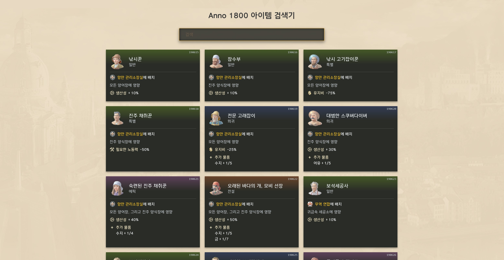

# Anno 1800 아이템 검색기

유비소프트 개발 **Anno 1800**에 등장하는 장착 가능한 아이템들을 확인할 수 있는 웹 페이지입니다.

[](https://ellisein.github.io/anno1800-items/)



### 참고: 게임 데이터 추출 방법

아래 방법으로 게임 데이터를 추출할 수 있습니다.

1. [RDAExplorer](https://github.com/lysanntranvouez/RDAExplorer)를 설치합니다.
1. 게임 설치 위치(스팀 기준 `C:\Program Files (x86)\Steam\steamapps\common\Anno 1800`)에서, 📁**maindata** 폴더에 있는 📄**data{num}.rda** 파일들을 RDAExplorer로 읽습니다. 게임 업데이트가 종료된 현재(2026.07) 기준 📄**data0.rda**부터 📄**data33.rda**까지 총 34개의 파일이 있습니다.
1. 파일을 순서대로 열면서 용도에 따라 필요한 파일 또는 폴더를 추출(Extract)합니다. 이 프로젝트에서는 이미지 파일을 얻기 위해 📁**data/ui/2kimages/main** 폴더를 추출하였습니다. 게임 데이터는 누적된 상태로 저장되어 있기 때문에 모든 데이터를 얻으려면 모든 rda 파일을 열어야 합니다.
1. 게임의 메타데이터는 📄**data/config/export/main/asset/assets.xml** 파일에, 한글 번역 정보는 📄**data/config/gui/texts_korean.xml** 파일에 저장되어 있습니다. 이 두 파일은 가장 최신 파일(📄**data33.rda**)의 정보만 읽으면 됩니다.
1. 이미지 파일을 추출한 경우 각 이미지는 dds 확장자로 되어 있습니다. [textconv.exe](https://github.com/microsoft/DirectXTex/releases/download/feb2020/texconv.exe)를 사용하여 읽을 수 있는 이미지 포맷으로 변환할 수 있습니다. 윈도우 환경에서는 **textconv.exe** 설치 후 아래 배치 명령어로 일괄 변환 가능합니다.
    ```
    FOR /R %%i IN (*.dds) DO (
        texconv -ft png -o "%%i\.." "%%i"
    )
    ```
    